# 清华大学第18届电子设计大赛“天赐良机”赛事总结

## 正式500字

清华大学第18届电子设计大赛，这场历时半年的科技竞赛活动，吸引了包括电子系、自动化系、电机系、生物医学工程系等多个院系，195名选手，共59支队伍参赛。本届电设主题为“天赐良机”，创新地在小车对抗的基础上引入无人机参战，首次在电设赛场上实现了陆空协同对抗。

无人机采用UWB室内定位：场地内设置有3个UWB地面站，分别测量其到无人机的距离，由此解算无人机的室内坐标。上位机发送当前位置和目标位置到无人机；无人机根据设计好的飞控算法，快速飞行到指定三维目标点，由此实现室内定点自动巡航。无人机飞行时，其下视摄像头拍到的画面会实时发送到第二块屏幕上。随着无人机的移动，无人机视角不断发生变化，拓展了观众的视野。另外，小车通过通讯模块向上位机提交数据，进而控制无人机的行动，由此达成陆空协同作战的效果。比赛中使用的无人机Dobby，由大赛赞助商“零度智控”提供。

比赛规则均由上位机呈现，比赛信息由通讯模块发给小车，小车凭此决策和行动。选手小车需在黑白区域内快速行动，并配合无人机拼抢目标点和道具。这样，小车在提高了机械对抗要求的同时，比赛也变得更加激烈和精彩。

## 图文

第18届电设，这一场历时半年的大型科技竞赛活动，吸引了包括电子系、自动化系、电机系、电机系、生物医学工程系等多个院系，195名选手，共59支队伍参赛。

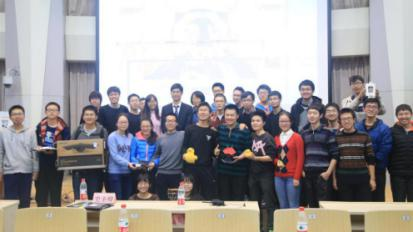

本届电设主题“天赐良机”，在传统的小车对抗的基础上引入了无人机，并在决赛现场实现了地空协同作战：

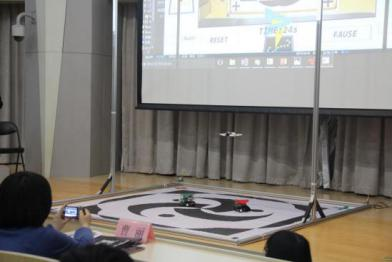

当无人机在场内飞行时，其下视摄像头拍摄到的场景也会实时的发送到第二块屏幕上。在比赛进行中，无人机不断改变悬停位置和悬停高度，其视角也不断的发生变化，极大地提升了比赛的观赏性：

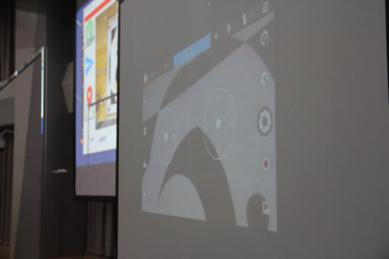

比赛中使用的无人机Dobby，由大赛赞助商“零度智控”提供。

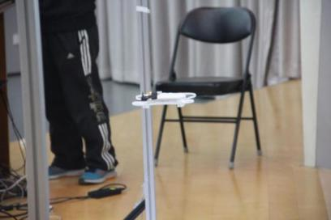

无人机采用UWB定位。比赛场地内设置有3个UWB地面站，分别测量到Dobby的距离，随后由上位机解算无人机的三维坐标。小车采用色块定位。场地顶端设置有摄像头，小车顶部装有毛毡色块。同时，比赛地图有4个定位十字，方便了坐标的标定。

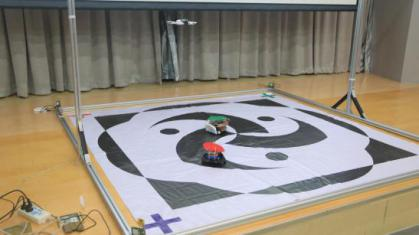

比赛规则均由上位机呈现。选手的小车需要黑白区域内快速移动，配合无人机抢夺目标点和道具。比赛信息通过通讯模块发送给小车，小车凭此在场内决策和行动。按照规则，小车需要在场内快速行动和拼抢目标，增加物理对抗难度的同时，大大提升了比赛的观赏性。

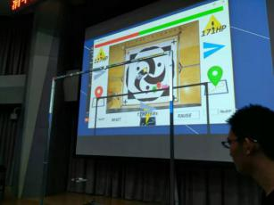

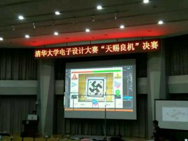

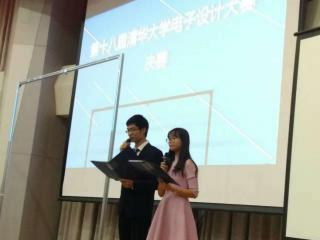

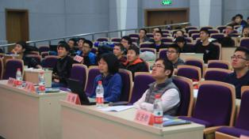

## 决赛成绩

### 特等奖

- 毕骏达、黄铭涛、王宽、王紫颐

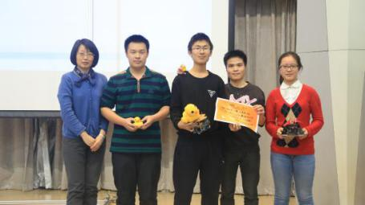

### 一等奖

- 翁喆、何玉寒、周晓宇、王文鑫

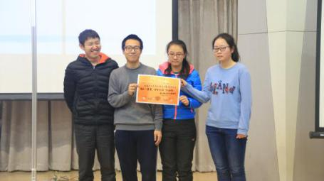

### 二等奖

- 时子威、吴聪、史旭、梁子平
- 许璀杰、马泽宇、詹明韬、李桐

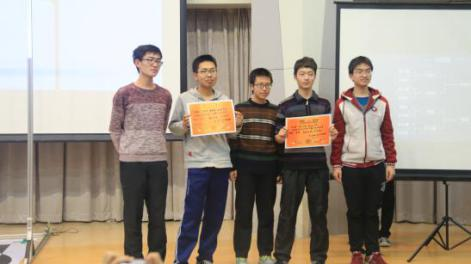

### 三等奖

- 虞竹珺、关慧哲、张广伦、刘洋
- 于光辉、陈逸凡、吴珏键
- 郝敏升、翁家奕、黄松睿、孙钊乐
- 曹天乐、刘定坤、余文卓

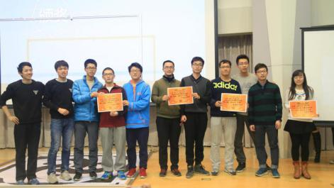

### 优胜奖

- 蒋婧灵、唐敏学、徐泽来、郭玮哲
- 陈苇航、郭凯文、欧天盛
- 孙铭、高子杰、路诗嘉、李子儒
- 孙浩淼、王子安、孙翔宇、郑思远
- 刘乐章、王伯毅、蔡若瑾、张涛
- 罗春砜、魏旭
- 张蔚桐、尹秋阳、陆逸文、陈崴
- 贾岳青、马恺、陈昭东、李博远

## 开发组

### 无人机

温拓朴、翁喆、丁文浩

### 上位机

王旭康、孙浩淼、陈奕鑫、杜昱博、田毅、时子威

### 通讯

毕骏达、范书沛、王思宇、张寒

### 地图和场地

张贺然、谭淞耀、李子儒、樊子辰、李逢双、李子昂

### 样车

黄铭涛、王宽、刘乐章、王伯毅、石莱茜、姜宏伟、韦祎、邓翔天

### 网络和宣传

何子昊、宗泽方、赵旺、黄羽丰、刘畅、张亿